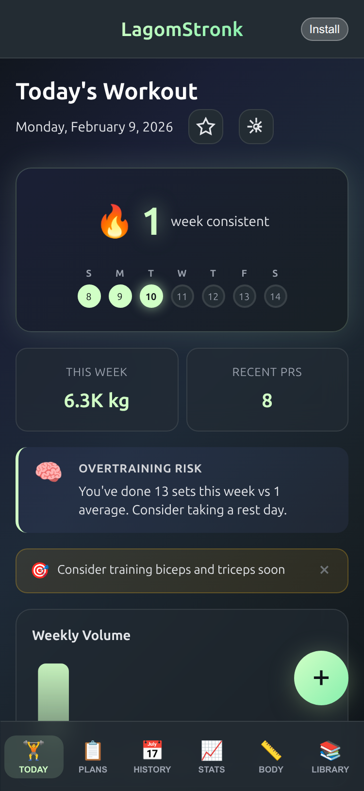
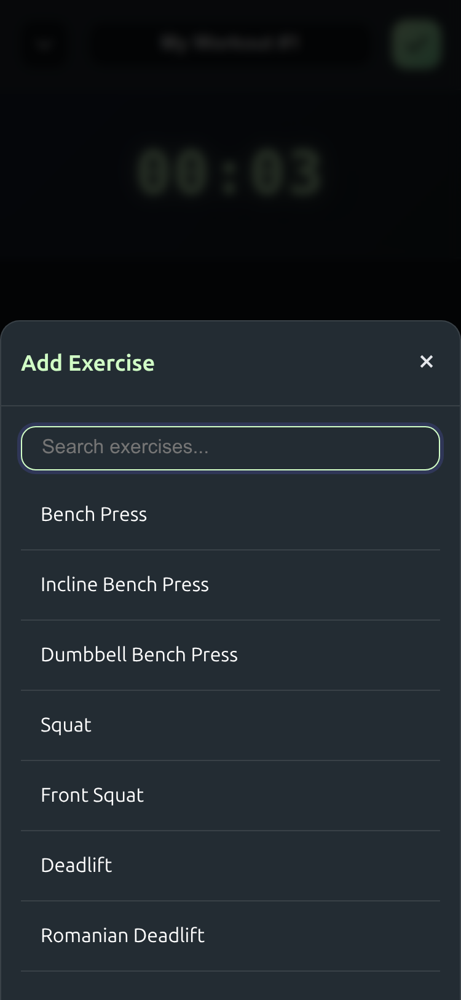
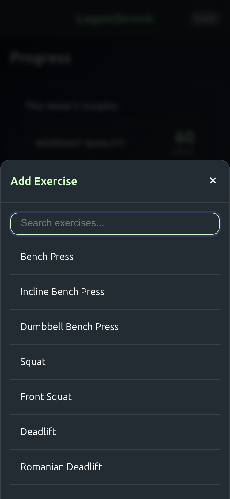

<h1 align="center">LagomStronk</h1>

<p align="center">
  <em>Strength training that feels effortless and intelligent</em>
</p>

<p align="center">
  <a href="https://github.com/JesperMorais/LagomStronk/actions/workflows/build-apk.yml">
    
  </a>
</p>

<p align="center">
  
</p>

<p align="center">
  A workout tracking app built for lifters who want intelligent insights without the friction.<br>
  Track progress, crush PRs, and watch your strength grow — all with a UI that gets out of your way.
</p>

---

## What Makes It Special

<table>
  <tr>
    <td width="50%">
      <h3>🏋️ Smart Workout Logging</h3>
      Log sets with instant previous-workout hints. Custom numpad designed for the gym — no hunting for numbers while chalk is on your hands.
    </td>
    <td width="50%">
      <h3>🏆 PR Detection & Celebrations</h3>
      Hit a new personal record? Watch the gold confetti rain. Every PR is tracked automatically and celebrated — because that hard work deserves recognition.
    </td>
  </tr>
  <tr>
    <td width="50%">
      <h3>📊 Intelligence Engine</h3>
      Get smart recommendations based on your training patterns. Recovery insights, fatigue detection, and exercise suggestions that actually make sense.
    </td>
    <td width="50%">
      <h3>🔥 Streaks & Achievements</h3>
      Build weekly training streaks with rest-day-aware logic. Earn 11 unique badges as you progress — from First Workout to PR Machine.
    </td>
  </tr>
  <tr>
    <td width="50%">
      <h3>📈 Progress Tracking</h3>
      Quality scores show if you're progressing, maintaining, or regressing. Muscle heatmaps reveal training balance. Trend analysis keeps you honest.
    </td>
    <td width="50%">
      <h3>💪 Body Tracking</h3>
      Track weight, measurements (bicep, chest, waist, thigh), and body fat percentage. Beautiful trend charts show your transformation over time.
    </td>
  </tr>
  <tr>
    <td width="50%">
      <h3>📱 Training Programs</h3>
      Built-in PPL and 5x5 programs, or create your own. Coach intelligence provides contextual hints during workouts.
    </td>
    <td width="50%">
      <h3>⏱️ Rest Timer</h3>
      Configurable rest periods with lock screen media controls. Your phone stays locked, the timer keeps running.
    </td>
  </tr>
</table>

---

## The Experience

<p align="center">
  
  
  
  
</p>

<p align="center">
  <em>Dashboard → Start Workout → Log Sets → Track Progress</em>
</p>

The workout flow is designed for the gym: tap to start a program, log sets inline with previous hints visible, use the custom numpad to punch in weights and reps, hit the checkmark, move on. The mini-player floats at the bottom showing elapsed time and volume. When you finish, PRs are detected automatically and celebrated with confetti.

The insights dashboard shows what matters: Are you progressing? Which muscles need attention? What's your training quality score? All visualized with charts that actually tell a story.

---

## Built With

**Core:** Vanilla JavaScript, IndexedDB, Service Workers (PWA)
**Charts:** Chart.js for progress visualization
**UI:** Canvas Confetti for celebrations, custom numpad component
**Mobile:** Capacitor for native Android builds

No frameworks. No build complexity. Just clean, fast JavaScript that runs everywhere.

---

## Quick Start

```bash
# Install dependencies
npm install

# Run locally (dev server)
npm start

# Build for Android
npm run build:android
```

Open `http://localhost:3000` and start logging workouts.

---

## Why I Built This

I got tired of workout apps that felt like spreadsheets with a UI slapped on. Every rep entry was a chore. Every PR went unnoticed. Progress tracking meant squinting at tables of numbers.

So I built something different. An app that celebrates your wins, learns from your patterns, and gets out of your way when you're under the bar. Something that feels like it was made by someone who actually lifts.

This is the app I wanted. Now it's here.

---

<p align="center">
  Built with ❤️ and chalk dust
</p>
